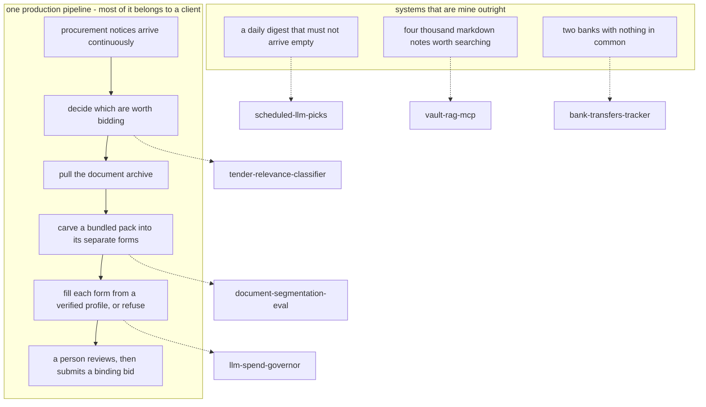

# Vsevolod Markov

Automation and applied AI, based in Barcelona.

I build internal systems that run without being watched. For the past year that has meant
being the only engineer on two production platforms at once. Deciding the architecture,
deploying it, and being the person who gets called when it breaks.

Most of that code belongs to a client and cannot be published. The repositories below are
the parts that could be separated from it. Each one is a mechanism I had to get right in
production, rewritten from nothing against a domain that's mine to publish, with the
evidence for whatever it claims committed next to it.

## Where they came from

The dotted edges are the honest part. Nothing was copied across them: the mechanism is
the same and the domain, the prompts, the fixtures and the corpus were written from
nothing, because a find-and-replace over a client's business rules isn't a rewrite.

## The repositories

| | What it is | Why it might be worth opening |
|---|---|---|
| **[llm-spend-governor](https://github.com/sevamrk/llm-spend-governor)** | Counts every model call a process makes, prices it, and refuses the next one before it is sent | The estimator is measured against the bill on ten request shapes. Nine are covered. The tenth is a defect the README states rather than patches |
| **[document-segmentation-eval](https://github.com/sevamrk/document-segmentation-eval)** | Carves long documents into their sections through four tiers, the last of which is a person | An ablation report switches each mechanism off and prints what breaks, including the rows where nothing breaks and what that does not prove |
| **[tender-relevance-classifier](https://github.com/sevamrk/tender-relevance-classifier)** | A model says what a procurement notice is; a deterministic gate decides what happens to it | `make trace` prints one notice through every stage, replayed, so the argument can be checked without an API key |
| **[scheduled-llm-picks](https://github.com/sevamrk/scheduled-llm-picks)** | A scheduled model call that always delivers something usable: validate, retry with the reason, then a deterministic fallback | Measured over two hundred runs against a model rigged to fail. Sixty-three first attempts were unusable and every run still delivered |
| **[vault-rag-mcp](https://github.com/sevamrk/vault-rag-mcp)** | Hybrid retrieval over a markdown vault, served as an MCP server | Keyword and vector branches fused by rank, then a cross-encoder reranker, which the evaluation shows losing to plain fusion on the demo corpus |
| **[bank-transfers-tracker](https://github.com/sevamrk/bank-transfers-tracker)** | Syncs personal finances across two banks that have nothing in common | One has a REST API. The other has no API at all and a CSV export whose headers change with the account's locale |

Each one runs its tests on a clean clone with no credentials, has CI proving it, and a README
that says what the thing doesn't do.

## The work behind them

**A tender-automation platform for a business-travel agency.** Public procurement notices
arrive continuously; a model reads and classifies them for relevance, pulls the full document
archive, and writes structured requirements into the CRM. One click then splits a bundled
procurement pack. Russian law puts 5–15 distinct forms inline in a single file, each of which
must be submitted separately. Into standalone documents, fills them from a verified company
profile, and hands them back submission-ready. It took the team from roughly one or two
tenders a day to about ten.

**The part I find more interesting than the automation:** the output is a bid under public
procurement regulation, and it's binding once filed. So no price and no tender-specific value
is ever model-generated. Only profile-verified data is written, every filled pack lands in a
review state before a person submits it, and the fill logic fails blank rather than failing
wrong. Getting that right meant negative tests guarding the wrong-fill direction, per-shape
bindings so a template change cannot silently write into the wrong cell, and segmenting a
bundle before filling so each form fails in isolation instead of taking the pack down with it.

**Production safeguards that exist because something went wrong first:** a fail-closed spend
circuit-breaker built after a real cost leak, webhook de-duplication, retry and backoff against
an unreliable vendor API, and static eval checks wrapped around a non-deterministic core.

## Working with

Python · SQL and Postgres · TypeScript · n8n · Docker · LLM APIs · CRM platforms

## Elsewhere

[LinkedIn](https://linkedin.com/in/vsevolod-markov) is the best way to reach me.

Barcelona, Spain. Authorised to work here, no sponsorship required. Russian and English
natively, Spanish at B2 and climbing.
